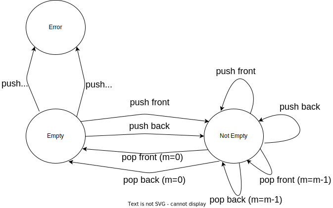

# 目的
練習 Andrew 架構師文章/演說當中提到的基本能力: **抽象化**以及**降級(具象化)** 的能力

- [[架構師的修練] #1, 刻意練習 - 打好基礎](https://columns.chicken-house.net/2021/03/01/practice-01/)
- [架構師觀點 - API Design Workshop](https://columns.chicken-house.net/2023/01/01/api-design-workshop/)
- [微服務架構 - 從狀態圖來驅動 API 的設計](https://columns.chicken-house.net/2022/03/25/microservices15-api-design/)


技能:
- OOP
- FSM
- TDD

# 練習
用 doubly linked list 實作一個 deque


# 說明
1. 先畫出狀態機:
    



2. 根據狀態機寫出 test cases
    ```python
    cases = [
        [('f', 0), ('f', 1), ('f', 2)],       # 0
        [('f', 0), ('b', 1), ('b', 2)],       # 1
        [('b', 0), ('b', 1), ('b', 2)],       # 2
        [('b', 0), ('f', 1), ('f', 2)],       # 3
        [('b', 0), ('b', 1), 'b', ('b', 2)],  # 4
        [('b', 0), ('b', 1), 'f', ('b', 2)],  # 5
        [('b', 0), ('b', 1), 'b', 'b'],       # 6
        [('b', 0), ('b', 1), 'f', 'f'],       # 7
        [('b', 0), 'b', 'b'],                 # 8
        [('f', 0), 'f', 'f'],                 # 9
    ]
    ```
    有兩種 input:
    - tuple (front/back, n) -> push
    - string (front/back) -> pop

3. 再開始實作 deque

    linked-list node:
    
    


